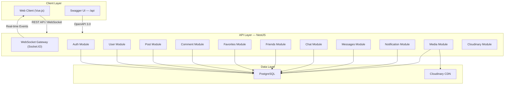
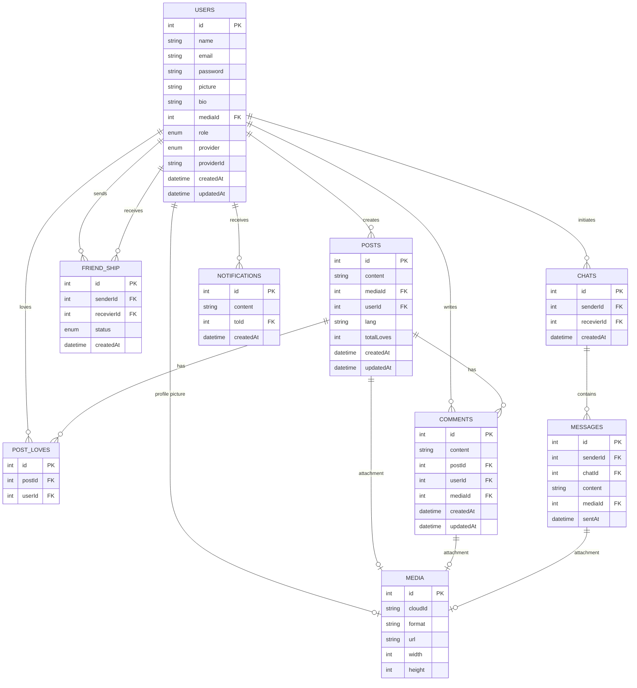

# Social App — Full-Stack Social Media Platform

> A real-time social networking REST API built with **NestJS**, **TypeORM**, **PostgreSQL**, and **Socket.IO**, featuring Google OAuth, real-time messaging, and WebRTC-ready video calling infrastructure.

---

## 🏗️ Architecture Overview



---

## 🔑 Key Features

### Authentication & Authorization

| Feature                       | Details                                                                                                                                     |
| ----------------------------- | ------------------------------------------------------------------------------------------------------------------------------------------- |
| **Google OAuth 2.0**          | Full flow with `google-auth-library` — authorization URL generation, token exchange, ID token verification, and automatic user provisioning |
| **Email/Password Auth**       | Registration with bcrypt password hashing (salt rounds) and login with credential verification                                              |
| **JWT Tokens**                | Stateless authentication via Passport.js JWT strategy with configurable expiration                                                          |
| **Role-Based Access Control** | Custom `@Role()` decorator + `RoleGuard` supporting Admin/User roles                                                                        |
| **Global Auth Guards**        | JWT guard applied at controller level, with Swagger Bearer Auth integration                                                                 |

### Social Networking

| Feature              | Details                                                                                         |
| -------------------- | ----------------------------------------------------------------------------------------------- |
| **Posts**            | Full CRUD with media attachments (image/video via Cloudinary), language tagging, and pagination |
| **Love/Like System** | Toggle-based love reactions with optimistic `totalLoves` counter on posts                       |
| **Comments**         | Threaded comments on posts with media attachment support and user attribution                   |
| **Favorites**        | Bookmark/favorite posts for later retrieval                                                     |
| **Friend System**    | Send/accept/reject/cancel friend requests with `PENDING → ACCEPT/CANCEL` state machine          |

### Real-Time Communication

| Feature                 | Details                                                                                       |
| ----------------------- | --------------------------------------------------------------------------------------------- |
| **WebSocket Gateway**   | Socket.IO-based gateway with JWT authentication at the adapter level                          |
| **Real-Time Messaging** | Direct messaging between users with online presence tracking (`onlineUsers` map)              |
| **Typing Indicators**   | `START_TYPING` / `STOP_TYPING` events for real-time feedback                                  |
| **Video Calling**       | WebRTC signaling infrastructure — `CALL_OFFER` and `CALL_ACCEPT` events with peer ID exchange |
| **Chat Rooms**          | Dynamic room creation, joining, and leaving for group communication                           |
| **Chat Management**     | 1-on-1 chat creation with duplicate prevention, paginated chat list with user info            |

### Media & Storage

| Feature                    | Details                                                                                                    |
| -------------------------- | ---------------------------------------------------------------------------------------------------------- |
| **Cloudinary Integration** | Upload files with auto resource type detection, quality optimization (80%), and organized folder structure |
| **Media Entity**           | Tracks `cloudId`, `format`, `url`, `width`, `height` for every uploaded file                               |
| **Profile Pictures**       | Dedicated profile picture update endpoint with old media cleanup                                           |

---

## 🛠️ Tech Stack

| Layer           | Technology                                                                               |
| --------------- | ---------------------------------------------------------------------------------------- |
| **Runtime**     | Node.js + TypeScript                                                                     |
| **Framework**   | NestJS 10                                                                                |
| **ORM**         | TypeORM 0.3 with PostgreSQL driver (`pg`)                                                |
| **Auth**        | Passport.js + JWT (`@nestjs/jwt`, `passport-jwt`) + Google OAuth (`google-auth-library`) |
| **Real-Time**   | Socket.IO via `@nestjs/websockets` + `@nestjs/platform-socket.io`                        |
| **Validation**  | `class-validator` + `class-transformer` with global `ValidationPipe`                     |
| **File Upload** | Multer (`@nestjs/platform-express`) → Cloudinary                                         |
| **API Docs**    | Swagger / OpenAPI 3.0 (`@nestjs/swagger`)                                                |
| **Security**    | bcrypt password hashing, CORS, request logging (Morgan)                                  |
| **Database**    | PostgreSQL with TypeORM migrations support                                               |

---

## 📐 Database Design (ERD)



---

## 🌐 API Endpoints

### Auth (`/api/v1/auth`)

| Method | Endpoint           | Description                                    |
| ------ | ------------------ | ---------------------------------------------- |
| `GET`  | `/google`          | Get Google OAuth authorization URL             |
| `GET`  | `/google/callback` | Google OAuth callback — exchanges code for JWT |
| `POST` | `/register`        | Register with email & password                 |
| `POST` | `/login`           | Login with email & password → returns JWT      |

### Users (`/api/v1/users`) 🔒

| Method   | Endpoint   | Description                        |
| -------- | ---------- | ---------------------------------- |
| `GET`    | `/me`      | Get authenticated user profile     |
| `PATCH`  | `/me/pic`  | Update profile picture (multipart) |
| `GET`    | `/:userId` | Get user by ID                     |
| `DELETE` | `/`        | Delete own account                 |

### Posts (`/api/v1/posts`) 🔒

| Method   | Endpoint | Description                     |
| -------- | -------- | ------------------------------- |
| `POST`   | `/`      | Create post with optional media |
| `GET`    | `/`      | Get all posts (paginated)       |
| `GET`    | `/:id`   | Get single post                 |
| `POST`   | `/love`  | Toggle love on a post           |
| `PATCH`  | `/:id`   | Update post                     |
| `DELETE` | `/:id`   | Delete post                     |

### Comments (`/api/v1/comments`) 🔒

| Method   | Endpoint | Description                         |
| -------- | -------- | ----------------------------------- |
| `POST`   | `/`      | Create comment with optional media  |
| `GET`    | `/`      | Get comments for a post (paginated) |
| `PATCH`  | `/:id`   | Update comment                      |
| `DELETE` | `/:id`   | Delete comment                      |

### Friends (`/api/v1/friends`) 🔒

| Method   | Endpoint                | Description                       |
| -------- | ----------------------- | --------------------------------- |
| `POST`   | `/`                     | Send friend request               |
| `GET`    | `/`                     | Get friend list                   |
| `GET`    | `/requests`             | Get pending friend requests       |
| `POST`   | `/accept-or-cancel/:id` | Accept or reject a friend request |
| `DELETE` | `/:id`                  | Remove friend                     |

### Chat (`/api/v1/chats`) 🔒

| Method | Endpoint | Description               |
| ------ | -------- | ------------------------- |
| `POST` | `/`      | Create new chat           |
| `GET`  | `/`      | Get all chats (paginated) |
| `GET`  | `/:id`   | Get chat by ID            |

### Messages (`/api/v1/msgs`) 🔒

| Method   | Endpoint   | Description                        |
| -------- | ---------- | ---------------------------------- |
| `POST`   | `/`        | Send message with optional media   |
| `GET`    | `/:chatId` | Get messages in a chat (paginated) |
| `PATCH`  | `/:id`     | Update message                     |
| `DELETE` | `/:id`     | Delete message                     |

### Notifications (`/api/v1/notifications`) 🔒

| Method   | Endpoint | Description                       |
| -------- | -------- | --------------------------------- |
| `GET`    | `/`      | Get all notifications (paginated) |
| `DELETE` | `/:id`   | Delete notification               |

### WebSocket Events

| Event          | Direction                | Description                  |
| -------------- | ------------------------ | ---------------------------- |
| `send-msg`     | Client → Server → Client | Direct message between users |
| `start-typing` | Client → Server → Client | Typing indicator start       |
| `stop-typing`  | Client → Server → Client | Typing indicator stop        |
| `call-offer`   | Client → Server → Client | Initiate WebRTC call         |
| `call-accept`  | Client → Server → Client | Accept incoming call         |
| `create-room`  | Client → Server          | Create chat room             |
| `join-room`    | Client → Server          | Join existing room           |
| `left-room`    | Client → Server          | Leave room                   |

---

## 📂 Project Structure

```
social-app/
├── src/
│   ├── main.ts                    # Bootstrap — Swagger, CORS, WebSocket adapter, global pipes
│   ├── app.module.ts              # Root module — imports all feature modules
│   ├── decorators/                # Custom decorators (@Role) and enums
│   ├── middlewares/               # Morgan HTTP request logging
│   ├── utils/                     # Pagination helper, auth types (AuthRequest, AuthSocket)
│   ├── socket/
│   │   ├── events.gateway.ts      # WebSocket gateway — messaging, typing, calls, rooms
│   │   ├── socket.adapter.ts      # Custom WS adapter with JWT authentication
│   │   ├── dtos/                  # Socket event validation DTOs
│   │   ├── enums/                 # Event name enums (ChatEvents, CallEvents, RoomEvents)
│   │   ├── filters/               # WS exception & validation filters
│   │   └── interfaces/            # OnlineUser interface
│   └── modules/
│       ├── DB/                    # TypeORM DataSource config + migrations
│       ├── auth/                  # JWT + Google OAuth strategies, guards, login/register
│       ├── user/                  # User CRUD, profile picture management
│       ├── post/                  # Posts with media, love/like system
│       ├── comment/               # Comments on posts with media
│       ├── favorites/             # Post bookmarking
│       ├── friends/               # Friend request lifecycle
│       ├── chat/                  # 1-on-1 chat management
│       ├── msgs/                  # Messages within chats
│       ├── notification/          # In-app notifications
│       ├── media/                 # Media entity management
│       └── cloudinary/            # Cloudinary upload/delete service
├── .env.dev                       # Environment configuration
├── nest-cli.json                  # NestJS CLI config
├── tsconfig.json                  # TypeScript configuration
└── package.json                   # Dependencies & scripts
```

---

## ⚡ Technical Highlights

- **Modular Architecture** — 12 decoupled feature modules following NestJS best practices (single responsibility, dependency injection)
- **Custom WebSocket Adapter** — JWT-authenticated Socket.IO connections with user context injection at the adapter level
- **Reusable Pagination** — Generic `pagination()` utility working with TypeORM `QueryBuilder` instances, returning `{ data, total, page, limit }`
- **Media Pipeline** — Unified file upload flow: `Multer → Cloudinary (CDN) → Media entity (DB)`, reused across posts, comments, messages, and profile pictures
- **Class Serialization** — `ClassSerializerInterceptor` + `@Exclude()` decorator to strip sensitive fields (passwords) from API responses
- **Online Presence** — In-memory `Map` tracking connected users for real-time direct messaging and call routing
- **OpenAPI Documentation** — Auto-generated Swagger docs with Bearer Auth scheme at `/api`
